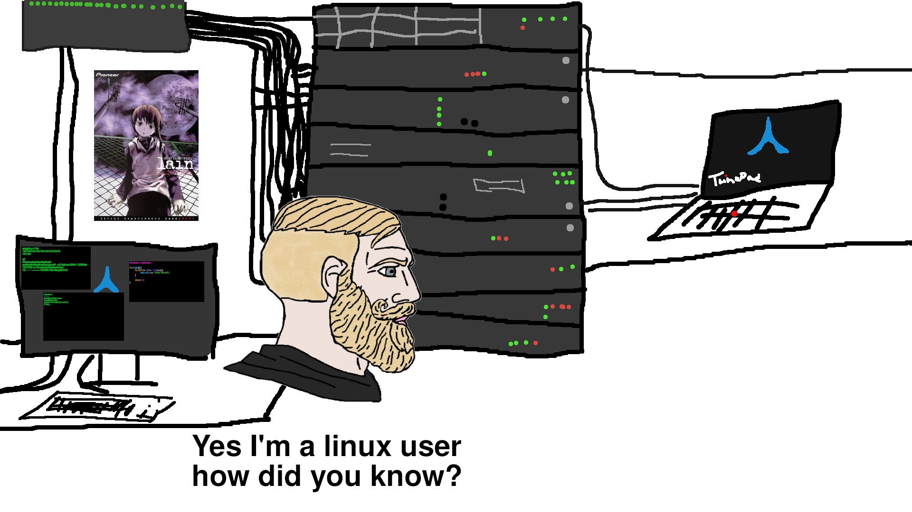
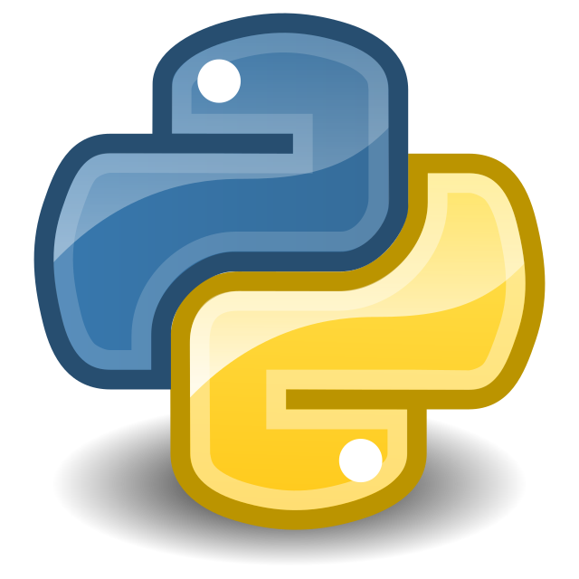

# Hi!
<
Junior Linuxero

_soy programador desde el 2024_

Actualmente no he trabajado en ningun proyecto serio, aunque pronto pienso hacer alguno

Las tecnologias que estoy aprendiendo son:

     

## Metas antes de terminar el 2025 :sparkles:

## Metas antes de terminar el 2025 ✨

| Metas | Progreso |
| :--- | :--- |
| **Aprender a dibujar** | - [ ] Dibujo de perspectivas - [ ] Sombreado básico |
| **Saber LaTeX** | - [ ] Entender la sintaxis |
| **Hablar inglés/Portugués** | - [ ] Estudiar 30 minutos al día |
| **Saber a qué área me quiero dedicar de la programación** | - [x] ... |
| **Subir mi primer gran proyecto** 😼 | - [ ] ... |

...

---

> Contacto

/>
